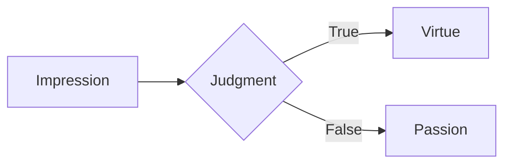

> *“It’s not things that disturb us, but our judgments about things.”*  
> — **Epictetus**, *Enchiridion* `§5`

---

# 1 · Premise `<h1>`

## 1.1 · Why test Markdown? `<h2>`

Stoicism trains us to **stress-test** our own assumptions.  
Likewise, this post stress-tests your *markdown renderer*—from ~~strikethrough~~ to `inline code`.

### 1.1.1 · Quick links `<h3>`

- [Virtue ≠ Outcome](#virtue--outcome)
- [Mathematical Aside](#mathematical-aside)
- [Appendices](#appendices)  

#### 1.1.1.1 · Footnote index `<h4>`

Numbers like [^1] jump to citations.

##### 1.1.1.1.α · Sub-sub heading `<h5>`

###### 1.1.1.1.α.i · And one more `<h6>`

---

## 2 · Virtue > Outcome <a id="virtue--outcome"></a>

1. **Perception**  
   1. We *see* an event.  
   2. We *judge* it—> passion arises.
2. **Choice** (προαίρεσις)  
   - Accept? ⬅️  
   - Reject? ➡️
3. **Action** → `External result` *(indifferent)*

| Facet           | Within control? | Stoic verdict |
|-----------------|-----------------|---------------|
| **Judgment**    | ✅ Yes          | Cultivate     |
| **Body**        | ❌ No           | Accept        |
| **Reputation**  | ❌ No           | Ignore        |

> 📝 **Key take-away:** *Train the judgment*, ignore noise.

---

## 3 · Mathematical Aside <a id="mathematical-aside"></a>

A tidy formula for serenity:

$$
\text{Serenity} = \frac{\text{Virtue}}{\text{Passion} + 1}
$$

> As $\text{Passion} \to 0$, Serenity $\to$ Virtue (maximum). 👌

---

## 4 · Multi-flavored code blocks

```bash
# Stoic morning routine
echo "Read Meditations"; echo "Premeditatio malorum"  # visualise obstacles
```

```python
def dichotomy_of_control(event):
    return "act" if event.is_internal() else "accept"
```



- Nested code block:

  ```md
  **bold _italic_**
  ```

---

## 5 · Lists, todo & miscellany

- **Daily practices**
  - [x] Morning reflection
  - [ ] Mid-day check-in
  - [ ] Evening review
- ~~Complain about weather~~
- Remember: `amor fati`

Break line with backslash → still same paragraph. :+1:

---

## 6 · Image test

  
*“Waste no more time arguing what a good man should be. Be one.”*

---

## 7 · Details / Summary

<details>
<summary>Click for a mini-rant on external validation 🙃</summary>

Because **other people’s praise** is outside our control, basing self-worth on it guarantees misery. Epictetus compares that to *hanging your happiness on a dove’s foot*—sooner or later it flies off.

</details>

---

## 8 · Table of Greek terms

| Greek | Latin | Meaning |
|-------|-------|---------|
| προαίρεσις | *prohairesis* | Rational faculty of choice |
| πάθος      | *passio*     | Disordered impulse |
| ἀπάθεια    | *apatheia*   | Healthy freedom from passion |

---

## 9 · Emoji taxonomy

:seedling: **Impression** → :brain: **Judgment** → :muscle: **Action**

---

## 10 · HTML inline <kbd>tags</kbd>

Press <kbd>Alt</kbd> + <kbd>F7</kbd> to skip negative thoughts. 😉

---

## 11 · The Mandelbrot cameo

```math
z_{n+1} = z_n^2 + c
```

Chaotic, but still **deterministic**—just like life’s externals.

---

## Appendices <a id="appendices"></a>

### A. Checklist to stay serene

| # | Trigger | Stoic counter-move |
| :-: | --- | --- |
| 1 | Manager frowns | *Only her judgment; irrelevant to mine.* |
| 2 | Bad traffic | *Not up to me; use time to rehearse maxims.* |
| 3 | Inbox flood | *Tackle one email; focus on present action.* |

### B. Footnotes

[^1]: *Discourses* 1.1 reminds us that prohairesis is the only thing truly “ours.”

---

> **Bottom line:** If this wall of Markdown rendered fine, your site is ready for anything—and so are you, as long as you guard your *prohairesis*. 🛡️
